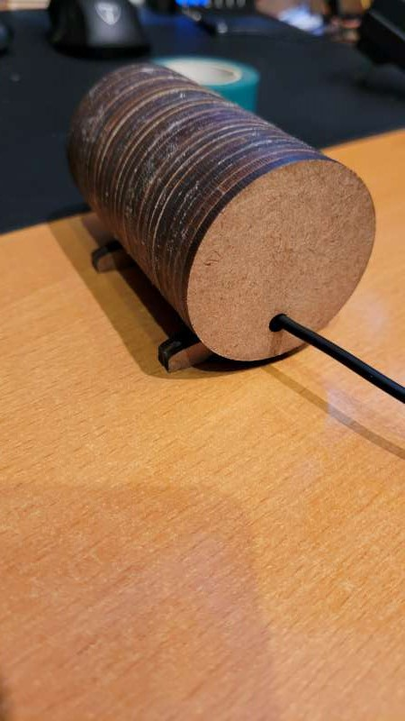

# GPS-Nano-and-Laser-Cut-case

GPS module and Nano with 0.96" OLED Display in a laser cut enclosure
Items used:
Arduino Nano
TELCO132 GPS module
0.96" OLED Display (128x64) I2C interface
Laser Cut Enclosure

Found the cheap GPS module at aliexpress( approx $6 CDN) so decided to give it a try with a NANO module.
Found the TINYGPS++ library that works great for parsing the NEMA data stream.
Used the Adafruit SSD1306 library for the OLED display.

I was looking for a way to check my speedometer in my vechicles. With this unit I can confirm my speedometer with both Google maps and a GPS. More time then not, the car's speedometer was out almost 10 % for my vechicles. In Canada if your speedometer is out >= 10 % of actual, the dealer has to make changes to correct. If < 10% actual, it is your problem.

Other information I learned from GPS and accuracy. If linked to less then 7 satillites it is not very accuracte altitude and speed can be out over 20%. More than 7 satillites and it with in .05% for both speed and altitude.

On startup the TELCO132 module can take 5 minutes to link to any satillites(Cool Start). Reading the data sheet for the TECLO132 will tell you more.
The TELCO132 is a RS-232 serial unit, and is defaulted to 9600 8N1.

GPS and OLED module are 5v. 
GPS TX(D11)
    RX(D12)
OLED I2C
A4 and A5

Wish list:
Change the case's front to a banett cover like the back.
Add battery voltage.
Change the case design to use less wood and make it easier to align up the pieces.
Make a dual OLED case to allow for bigger digits.

